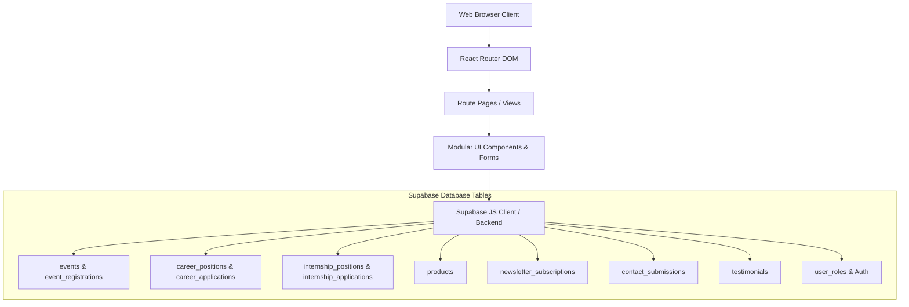

# 🛠️ Comprehensive Technical Requirements Document (TRD)
## Project: Innovex Arena Web Platform (High-Fidelity Clone)
**Document Version**: 2.0.0 (Exhaustive Architectural Blueprint)  
**Stack**: React 18+ / Vite + TypeScript + Tailwind CSS + Lucide Icons + Supabase (BaaS)  

---

## 1. System Architecture & Component Flow



---

## 2. Complete Database Schema (PostgreSQL / Supabase DDL)

```sql
-- 1. Newsletter Subscriptions
CREATE TABLE newsletter_subscriptions (
  id UUID PRIMARY KEY DEFAULT gen_random_uuid(),
  email TEXT UNIQUE NOT NULL,
  created_at TIMESTAMPTZ DEFAULT now()
);

-- 2. Contact Submissions
CREATE TABLE contact_submissions (
  id UUID PRIMARY KEY DEFAULT gen_random_uuid(),
  name TEXT NOT NULL,
  email TEXT NOT NULL,
  subject TEXT NOT NULL,
  message TEXT NOT NULL,
  created_at TIMESTAMPTZ DEFAULT now()
);

-- 3. Events & Registrations
CREATE TABLE events (
  id UUID PRIMARY KEY DEFAULT gen_random_uuid(),
  title TEXT NOT NULL,
  description TEXT,
  event_date TIMESTAMPTZ NOT NULL,
  end_date TIMESTAMPTZ,
  location TEXT DEFAULT 'Virtual',
  event_type TEXT NOT NULL, -- 'Workshop', 'Hackathon', 'Bootcamp'
  max_participants INTEGER DEFAULT 100,
  registration_deadline TIMESTAMPTZ,
  image_url TEXT,
  is_published BOOLEAN DEFAULT true,
  created_at TIMESTAMPTZ DEFAULT now()
);

CREATE TABLE event_registrations (
  id UUID PRIMARY KEY DEFAULT gen_random_uuid(),
  event_id UUID REFERENCES events(id) ON DELETE CASCADE,
  user_id UUID,
  name TEXT,
  email TEXT,
  phone TEXT,
  college TEXT,
  year_of_study TEXT,
  status TEXT DEFAULT 'pending',
  created_at TIMESTAMPTZ DEFAULT now()
);

-- 4. Products
CREATE TABLE products (
  id UUID PRIMARY KEY DEFAULT gen_random_uuid(),
  name TEXT NOT NULL,
  category TEXT NOT NULL, -- 'AI Solutions', 'Cloud Tools', 'IoT Projects'
  short_description TEXT,
  description TEXT,
  image_url TEXT,
  demo_url TEXT,
  github_url TEXT,
  technologies TEXT[], -- Array of strings e.g. ['React', 'Node.js', 'FastAPI']
  is_featured BOOLEAN DEFAULT false,
  is_published BOOLEAN DEFAULT true,
  created_at TIMESTAMPTZ DEFAULT now()
);

-- 5. Career Positions & Applications
CREATE TABLE career_positions (
  id UUID PRIMARY KEY DEFAULT gen_random_uuid(),
  title TEXT NOT NULL,
  job_type TEXT DEFAULT 'Full-time',
  location TEXT DEFAULT 'Remote / Hybrid',
  icon_name TEXT DEFAULT 'Briefcase',
  description TEXT NOT NULL,
  requirements TEXT NOT NULL,
  responsibilities TEXT NOT NULL,
  is_active BOOLEAN DEFAULT true,
  created_at TIMESTAMPTZ DEFAULT now()
);

CREATE TABLE career_applications (
  id UUID PRIMARY KEY DEFAULT gen_random_uuid(),
  position TEXT NOT NULL,
  name TEXT NOT NULL,
  email TEXT NOT NULL,
  phone TEXT,
  college TEXT NOT NULL,
  year_of_study TEXT NOT NULL,
  linkedin_url TEXT,
  github_url TEXT,
  personal_website TEXT,
  projects JSONB, -- Array of { title, liveUrl, githubUrl, description }
  cover_letter TEXT,
  status TEXT DEFAULT 'pending',
  created_at TIMESTAMPTZ DEFAULT now()
);

-- 6. Internship Positions & Applications
CREATE TABLE internship_positions (
  id UUID PRIMARY KEY DEFAULT gen_random_uuid(),
  title TEXT NOT NULL,
  duration TEXT DEFAULT '3-6 Months',
  location TEXT DEFAULT 'Remote / Hybrid',
  icon_name TEXT DEFAULT 'Code',
  description TEXT NOT NULL,
  requirements TEXT NOT NULL,
  responsibilities TEXT NOT NULL,
  is_active BOOLEAN DEFAULT true,
  created_at TIMESTAMPTZ DEFAULT now()
);

CREATE TABLE internship_applications (
  id UUID PRIMARY KEY DEFAULT gen_random_uuid(),
  position TEXT NOT NULL,
  name TEXT NOT NULL,
  email TEXT NOT NULL,
  phone TEXT,
  college TEXT NOT NULL,
  year_of_study TEXT NOT NULL,
  linkedin_url TEXT,
  github_url TEXT,
  personal_website TEXT,
  projects JSONB,
  cover_letter TEXT,
  status TEXT DEFAULT 'pending',
  created_at TIMESTAMPTZ DEFAULT now()
);

-- 7. Testimonials
CREATE TABLE testimonials (
  id UUID PRIMARY KEY DEFAULT gen_random_uuid(),
  name TEXT NOT NULL,
  role TEXT NOT NULL,
  company_or_college TEXT,
  content TEXT NOT NULL,
  rating INTEGER DEFAULT 5,
  avatar_url TEXT,
  is_approved BOOLEAN DEFAULT true,
  is_featured BOOLEAN DEFAULT true,
  created_at TIMESTAMPTZ DEFAULT now()
);
```

---

## 3. TypeScript Interfaces & Data Models

```typescript
// types/index.ts

export interface WorkshopItem {
  icon: string;
  title: string;
  description: string;
}

export interface ProjectEntry {
  id: string;
  title: string;
  liveUrl: string;
  githubUrl: string;
  description: string;
}

export interface CareerApplicationPayload {
  position: string;
  name: string;
  email: string;
  phone?: string;
  college: string;
  yearOfStudy: string;
  linkedinUrl?: string;
  githubUrl?: string;
  personalWebsite?: string;
  projects: ProjectEntry[];
  message?: string;
}

export interface ContactPayload {
  name: string;
  email: string;
  subject: string;
  message: string;
}
```

---

## 4. Asset Pipeline & Dependencies

### 4.1 Production `package.json` Dependencies
```json
{
  "name": "innovex-arena-clone",
  "private": true,
  "version": "1.0.0",
  "type": "module",
  "scripts": {
    "dev": "vite",
    "build": "tsc && vite build",
    "preview": "vite preview"
  },
  "dependencies": {
    "@supabase/supabase-js": "^2.45.0",
    "clsx": "^2.1.1",
    "lucide-react": "^0.436.0",
    "react": "^18.3.1",
    "react-dom": "^18.3.1",
    "react-router-dom": "^6.26.1",
    "tailwind-merge": "^2.5.2"
  },
  "devDependencies": {
    "@types/react": "^18.3.3",
    "@types/react-dom": "^18.3.0",
    "@vitejs/plugin-react": "^4.3.1",
    "autoprefixer": "^10.4.20",
    "postcss": "^8.4.41",
    "tailwindcss": "^3.4.10",
    "typescript": "^5.5.3",
    "vite": "^5.4.1"
  }
}
```

---

## 5. Quality Assurance & Pixel Verification Matrix

| Area | Test Criteria | Expected Result |
| :--- | :--- | :--- |
| **Styling & Fonts** | Google Fonts `Orbitron` & `Inter` loaded properly | Headers render with uppercase cyberpunk tracking; body is legible. |
| **Color Fidelity** | Neon Cyan `#00D9FF` and Purple `#8033E6` with dark background `#070A13` | Exact matching ambient glows and card borders. |
| **Dynamic Forms** | "+ ADD PROJECT" button functionality | Can add, edit, and delete dynamic project cards seamlessly. |
| **Routing** | 8 route links (`/`, `/services`, `/products`, `/events`, `/careers`, `/interns`, `/contact`, `/admin/login`) | Instant SPA navigation without page refresh. |
| **Responsive Drawer** | Mobile menu on `< 768px` viewports | Smooth opening, active link highlights, clean close transition. |
| **Form Submissions** | Contact & Application forms | Real-time validation, disabled submit during processing, and toast feedback. |
